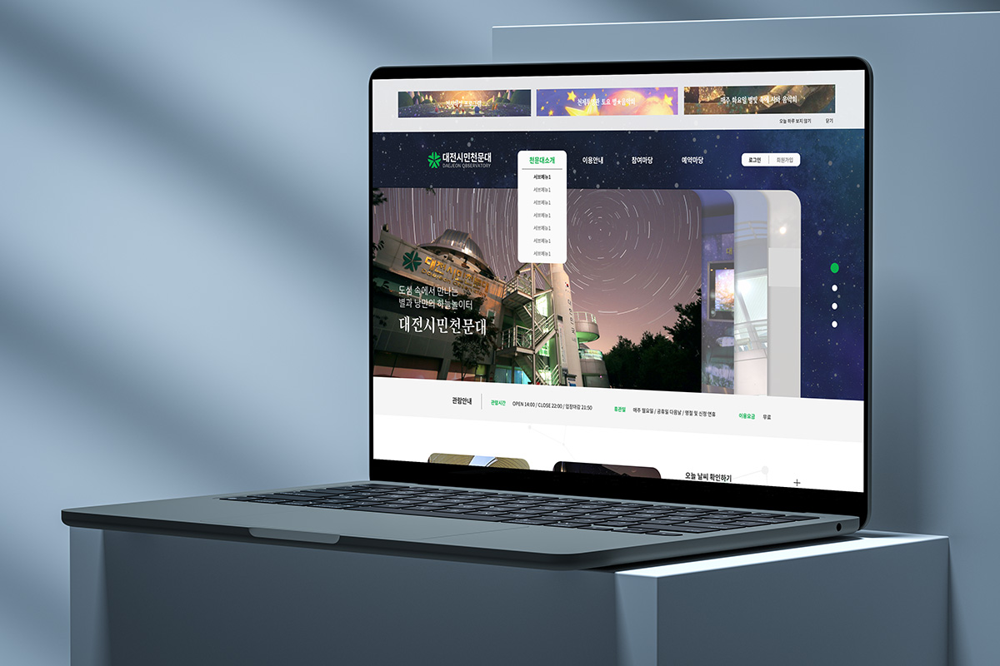

# 대전시민천문대 리뉴얼 프로젝트

## 🔗 [데모사이트](https://2chaelim.github.io/Pro2_DJStars/)

  

 

## 🔥 프로젝트 소개

> 개요 : 대전시민천문대 리뉴얼 프로젝트입니다.  
> 개발기간 : 2023.02.24 ~ 2023.03.24

 

## 🔥 리뉴얼 포인트

> 분산된 사이트맵

- 동일한 컨텐츠가 각각 다른 페이지에서 열리던 것을 한 페이지로 통일했습니다.

> 메인 화면을 가리는 모달창

- 특강, 행사 등을 홍보하는 팝업창이 홈페이지에서 불필요하게 많은 영역을 차지하고 있던 기존 사이트에서 상단 배너로 배치하여 시각적으로 깔끔해보이도록 정리했습니다.

> 레이아웃

- 반응형이 적용되어 있지 않은 부분을 모두 제작하여 추가했습니다.

> 사용자 편의성 향상

- 기존에 없던 개인 관람 예약을 탭 메뉴로 추가하고 페이지 이동 없이 예약할 수 있도록 개선했습니다.
- 온라인에서 불가능 하던 예약 취소 기능을 추가했습니다.
- 다수의 사용자가 사용할 요소(관람 및 관측 예약, 행사일정, 프로그램 소개 등)를 index에 추가했습니다.

 

## 📌 기술 스택

> 개발언어 :     
> 라이브러리 :   
> 사용툴 :   

 

## 🔗 참고 링크

> [약식기획서](https://docs.google.com/presentation/d/1PZsELZlvVKKN9mGNXlIuLr7Rc3w4KDz3E1k69gy3cZo/edit?usp=sharing)   [디자인시안](https://www.figma.com/file/bltAL8RB2xlw1OVpLhWyGq/%EB%8C%80%EC%A0%84%EC%8B%9C%EB%AF%BC%EC%B2%9C%EB%AC%B8%EB%8C%80?type=design&mode=design&t=7iWchq1gFBciam5G-1)
